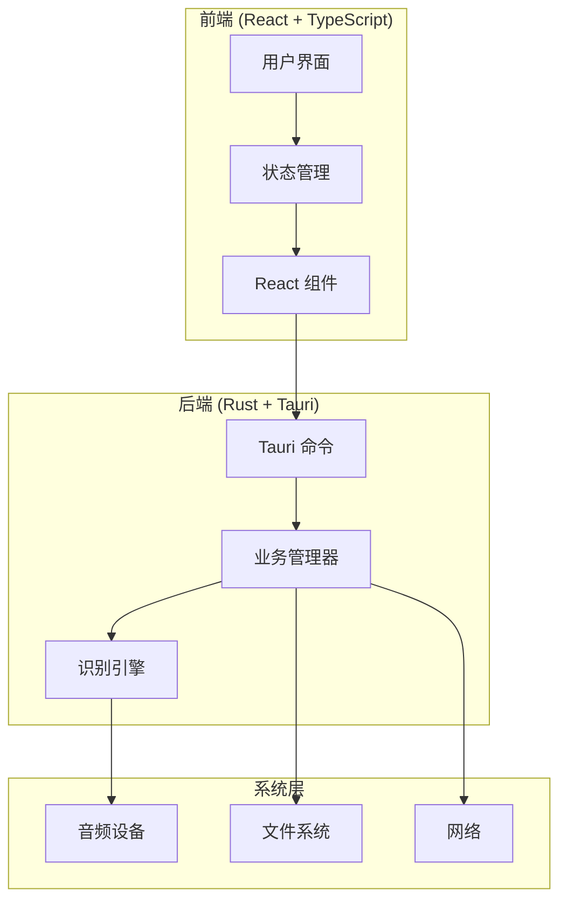
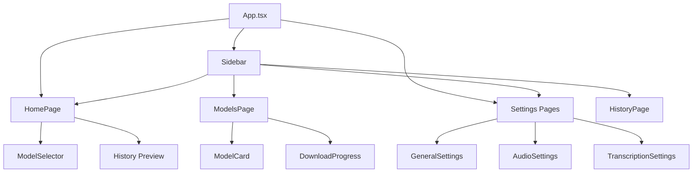
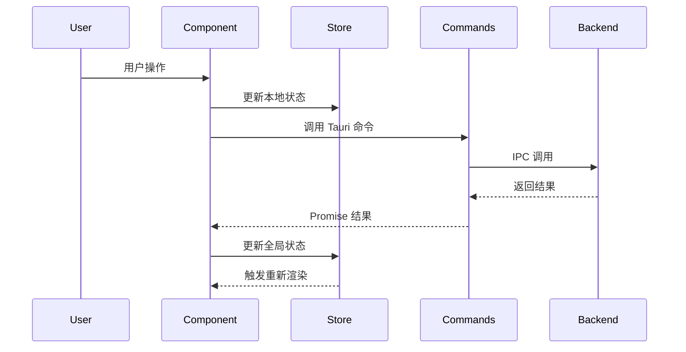
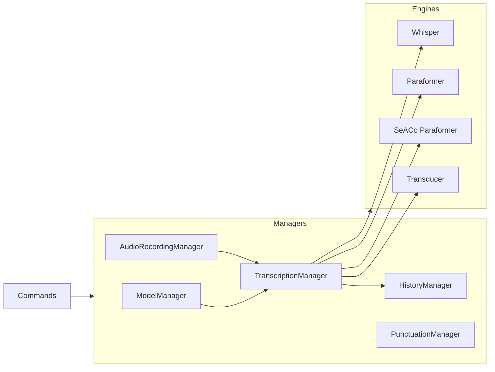
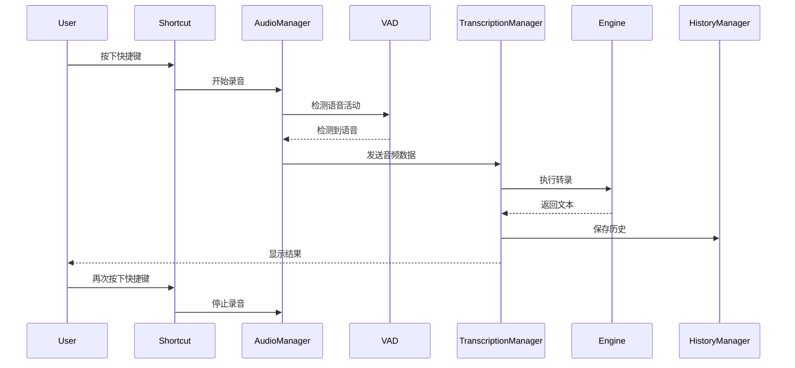
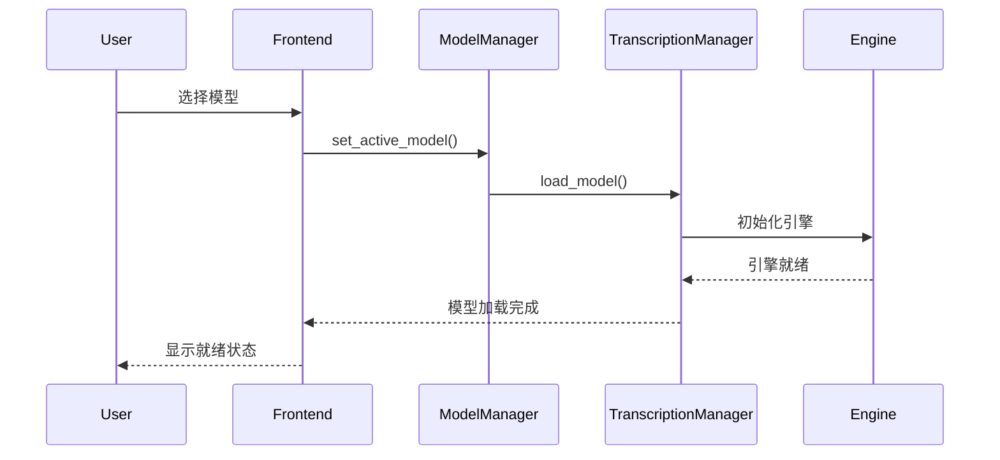
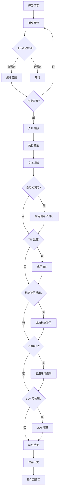
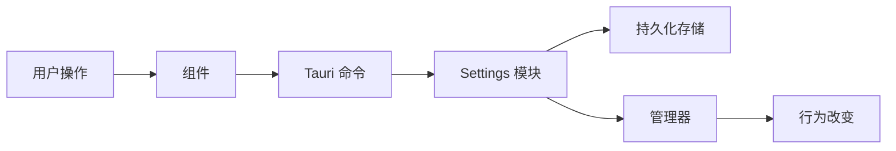
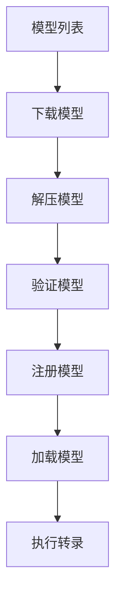
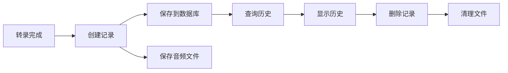

# KeVoiceInput 架构文档

本文档详细说明了 KeVoiceInput 应用的系统架构、模块结构和数据流。

## 目录

- [系统架构概览](#系统架构概览)
- [前端架构](#前端架构)
- [后端架构](#后端架构)
- [核心模块说明](#核心模块说明)
- [数据流](#数据流)
- [关键组件](#关键组件)

## 系统架构概览

KeVoiceInput 采用前后端分离的架构，使用 Tauri 框架将 React 前端和 Rust 后端紧密结合。



### 技术选型

- **前端框架**: React 18 + TypeScript
- **后端框架**: Tauri 2.9.1 (Rust)
- **通信方式**: Tauri IPC (基于 JSON-RPC)
- **状态管理**: Zustand
- **构建工具**: Vite (前端) + Cargo (后端)

## 前端架构

### 目录结构

```
src/
├── components/          # React 组件
│   ├── pages/          # 页面组件
│   ├── settings/        # 设置组件
│   ├── ui/              # UI 基础组件
│   └── ...
├── stores/              # Zustand 状态管理
│   ├── settingsStore.ts # 设置状态
│   └── modelStore.ts    # 模型状态
├── hooks/               # 自定义 Hooks
├── i18n/                # 国际化资源
│   └── locales/         # 多语言翻译文件（支持 14 种语言）
├── lib/                 # 工具库
│   ├── constants/       # 常量定义
│   └── utils/           # 工具函数
└── overlay/             # 录音覆盖层
```

### 状态管理

应用使用 Zustand 进行状态管理，主要包含两个 Store：

#### SettingsStore

管理应用设置状态：
- 应用设置（语言、快捷键等）
- 音频设备列表
- 设置更新方法

#### ModelStore

管理模型相关状态：
- 可用模型列表
- 当前激活的模型
- 模型下载进度
- 模型操作方法

### 组件架构



### 前端数据流



## 后端架构

### 目录结构

```
src-tauri/src/
├── commands/            # Tauri 命令接口
│   ├── models.rs        # 模型管理命令
│   ├── history.rs       # 历史记录命令
│   ├── audio.rs         # 音频设备命令
│   └── transcription.rs # 转录相关命令
├── managers/            # 业务逻辑管理器
│   ├── model.rs         # 模型管理器
│   ├── transcription.rs # 转录管理器
│   ├── audio.rs         # 音频录制管理器
│   ├── history.rs       # 历史记录管理器
│   └── punctuation.rs   # 标点符号管理器
├── audio_toolkit/       # 音频处理工具
│   ├── audio/           # 音频录制和播放
│   ├── text/            # 文本处理工具
│   └── vad/             # 语音活动检测
├── actions.rs           # 快捷键动作处理
├── settings.rs          # 设置管理
└── main.rs              # 应用入口
```

### 核心管理器

#### ModelManager

负责模型的生命周期管理：

- **功能**:
  - 模型列表管理
  - 模型下载和删除
  - 模型文件验证
  - 本地模型导入

- **关键方法**:
  - `get_available_models()` - 获取可用模型列表
  - `download_model()` - 下载模型
  - `delete_model()` - 删除模型
  - `import_local_model_folder()` - 导入本地模型

#### TranscriptionManager

负责语音转录的核心逻辑：

- **功能**:
  - 模型加载和卸载
  - 音频转录处理
  - 模型状态管理
  - 自动卸载机制

- **支持的引擎**:
  - Whisper (via transcribe-rs)
  - Paraformer (via sherpa-rs)
  - SeACo Paraformer (via sherpa-rs)
  - Transducer (via sherpa-rs)
  - FireRedAsr (via sherpa-rs)

- **关键方法**:
  - `load_model()` - 加载识别模型
  - `transcribe()` - 执行转录
  - `unload_model()` - 卸载模型

#### AudioRecordingManager

负责音频录制管理：

- **功能**:
  - 麦克风流管理
  - 录音开始/停止
  - VAD (语音活动检测)
  - 音频设备切换

- **工作模式**:
  - `AlwaysOn` - 始终开启麦克风
  - `OnDemand` - 按需开启麦克风

#### HistoryManager

负责历史记录管理：

- **功能**:
  - 转录历史存储
  - 历史记录查询
  - 录音文件管理
  - 历史记录清理

- **存储**:
  - SQLite 数据库存储元数据
  - 文件系统存储录音文件

#### PunctuationManager

负责标点符号自动添加：

- **功能**:
  - 标点符号模型加载和卸载
  - 为转录文本自动添加标点符号
  - 模型状态管理

- **实现**:
  - 使用 sherpa-rs 的 Punctuation 模块
  - 支持自动下载和加载标点符号模型

- **关键方法**:
  - `load_model()` - 加载标点符号模型
  - `add_punctuation()` - 为文本添加标点符号
  - `unload_model()` - 卸载模型

### 后端模块关系



## 核心模块说明

### 音频处理流程



### 模型加载流程



### 转录处理流程



## 数据流

### 设置数据流



### 模型数据流



### 历史记录数据流



## 关键组件

### 音频录制器 (AudioRecorder)

位于 `src-tauri/src/audio_toolkit/audio/recorder.rs`

**职责**:
- 音频流捕获
- 音频格式转换
- VAD 集成
- 音频数据回调

**关键特性**:
- 支持多种音频格式
- 实时音频处理
- 可配置的采样率
- VAD 集成

### 语音活动检测 (VAD)

位于 `src-tauri/src/audio_toolkit/vad/`

**实现**:
- Silero VAD - 基于深度学习的 VAD
- Smoothed VAD - 平滑处理，减少误检

**功能**:
- 检测语音开始和结束
- 过滤背景噪音
- 优化录音质量

### 转录引擎封装

#### Whisper 引擎

- **实现**: `transcribe-rs` crate
- **特点**: 高准确率，支持多语言
- **使用场景**: 高质量转录需求

#### Paraformer 引擎

- **实现**: `sherpa-rs` crate
- **特点**: 快速，支持中文
- **使用场景**: 中文语音识别

#### SeACo Paraformer 引擎

- **实现**: `sherpa-rs` + `model_eb.onnx`
- **特点**: 支持热词，中文优化
- **使用场景**: 需要热词支持的中文识别

#### Transducer 引擎

- **实现**: `sherpa-rs` crate
- **特点**: 流式识别，低延迟
- **使用场景**: 实时转录需求

### 设置管理

位于 `src-tauri/src/settings.rs`

**功能**:
- 设置读取和写入
- 设置验证
- 默认值管理
- 设置迁移

**存储位置**:
- macOS: `~/Library/Application Support/com.kevoiceinput.app/`
- Windows: `%APPDATA%\com.kevoiceinput.app\`
- Linux: `~/.config/com.kevoiceinput.app/`

### 快捷键系统

位于 `src-tauri/src/shortcut.rs` 和 `src-tauri/src/actions.rs`

**功能**:
- 全局快捷键注册
- 快捷键冲突检测
- 动作执行
- 快捷键持久化

**支持的动作**:
- 转录开始/停止
- 取消操作
- 其他自定义动作

### 历史记录系统

位于 `src-tauri/src/managers/history.rs`

**存储结构**:
- SQLite 数据库存储元数据
- 文件系统存储音频文件

**功能**:
- 自动保存转录记录
- 录音文件管理
- 历史记录查询
- 自动清理机制

### 文本处理工具

位于 `src-tauri/src/audio_toolkit/text.rs`

**功能**:
- **自定义词汇纠正**: 使用模糊匹配（Levenshtein 距离 + Soundex 语音匹配）纠正转录文本中的词汇
- **填充词过滤**: 自动移除填充词（如 "uh", "um", "hmm" 等）
- **口吃处理**: 压缩重复的 1-2 字母单词（如 "wh wh wh" -> "wh"）
- **ITN（逆文本规范化）**: 将中文数字转换为阿拉伯数字，处理日期、时间、货币等格式
- **热词规则**: 支持基于规则的热词替换和纠正
- **纠正记录**: 记录用户纠正的文本，用于 LLM 学习和改进

**关键函数**:
- `apply_custom_words()` - 应用自定义词汇纠正
- `filter_transcription_output()` - 过滤填充词和口吃
- `apply_itn()` - 应用逆文本规范化
- `apply_hot_rules()` - 应用热词规则
- `load_rectify_records()` - 加载纠正记录

**算法特点**:
- 使用 Levenshtein 距离计算字符串相似度
- 使用 Soundex 算法进行语音匹配
- 支持可配置的相似度阈值
- 保留原始文本的大小写和标点符号

## 性能优化

### 模型管理优化

- **延迟加载**: 模型仅在需要时加载
- **自动卸载**: 空闲时自动卸载模型释放内存
- **模型缓存**: 已加载的模型保持在内存中

### 音频处理优化

- **VAD 优化**: 使用 VAD 减少无效音频处理
- **音频缓冲**: 智能缓冲减少 CPU 占用
- **多线程处理**: 音频处理和转录并行执行

### 前端优化

- **代码分割**: 按需加载组件
- **状态优化**: 使用 Zustand 减少不必要的重渲染
- **虚拟滚动**: 历史记录列表使用虚拟滚动

## 扩展性

### 添加新识别引擎

1. 在 `EngineType` 枚举中添加新类型
2. 在 `TranscriptionManager` 中实现加载逻辑
3. 在 `transcribe()` 方法中添加转录逻辑
4. 更新前端模型选择器

### 添加新设置项

1. 在 `AppSettings` 结构体中添加字段
2. 在 `get_default_settings()` 中设置默认值
3. 添加对应的 Tauri 命令
4. 在前端添加设置 UI

### 添加新快捷键动作

1. 实现 `ShortcutAction` trait
2. 在 `actions.rs` 中注册动作
3. 在设置中添加快捷键配置
4. 更新前端快捷键设置 UI

## 安全考虑

### 权限管理

- macOS: 辅助功能权限（键盘输入）
- Windows/Linux: 麦克风访问权限
- 文件系统权限（模型和历史记录存储）

### 数据安全

- 本地存储所有数据
- 不发送音频数据到外部服务器（除非使用 API 转录）
- API Key 加密存储

### 代码安全

- Rust 内存安全保证
- 输入验证和错误处理
- 安全的 IPC 通信

## 故障排查

### 常见问题

1. **模型加载失败**
   - 检查模型文件完整性
   - 验证模型格式
   - 查看日志文件

2. **音频录制失败**
   - 检查麦克风权限
   - 验证音频设备可用性
   - 检查音频驱动

3. **转录结果不准确**
   - 检查模型选择
   - 调整音频设备设置
   - 添加自定义词汇

### 调试工具

- **日志系统**: 详细的日志记录
- **调试模式**: 启用调试模式查看详细信息
- **测试命令**: `test_sherpa_api` 用于测试识别引擎

## 未来改进

- [ ] 支持更多识别引擎
- [ ] 改进 UI/UX
- [ ] 性能优化
- [ ] 更多语言支持
- [ ] 云端同步功能
